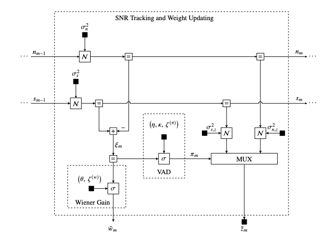
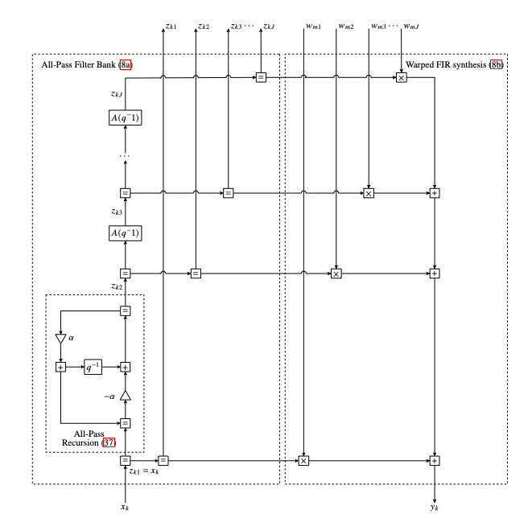

# A Probabilistic Generative Model for Spectral Speech Enhancement

This repository accompanies the paper:

> M. Hidalgo-Araya *et al.*, "A Probabilistic Generative Model for Spectral Speech Enhancement", 2025.

A comprehensive evaluation framework for virtual hearing aids using the VOICEBANK_DEMAND dataset with warped filter bank (WFB) preprocessing.

## How This Repository Relates to the Paper

This repository provides the complete implementation and evaluation framework for the spectral speech enhancement model presented in the paper. It includes:

- **Implementation**: Full codebase for the Warped-Frequency Filter Bank (WFB) front-end and Speech Enhancement Model (SEM) backend
- **Evaluation Pipeline**: Automated evaluation on the VOICEBANK_DEMAND dataset with comprehensive metrics (PESQ, DNSMOS)
- **Reproducibility**: All configurations and scripts needed to reproduce the results reported in the paper
- **Benchmark Comparisons**: Automated generation of comparison tables between different hearing aid algorithms

## Overview

This repository provides a complete pipeline for:
1. **Dataset Preparation**: Download, resample, and preprocess VOICEBANK_DEMAND dataset
2. **WFB Preprocessing**: Create warped filter bank processed dataset for consistent evaluation
3. **Evaluation**: Run evaluations for baseline and hearing aid algorithms using `run_evaluation.jl`
4. **Results Analysis**: Generate summary tables and metrics organized by SNR and environment
5. **Benchmark Results**: Automatically generate and update benchmark comparison tables in the README

### Quick Start - View Benchmark Results

The latest benchmark results comparing different hearing aid algorithms are automatically generated and displayed in the [Benchmark Results](#benchmark-results) section below. To update these results with the latest evaluation runs, simply run:

```bash
julia scripts/update_readme_benchmark.jl
```

This script automatically:
- Finds the latest runs for each hearing aid (excluding Baseline_clean)
- Generates comprehensive comparison tables for:
  - Overall summary across all metrics
  - Performance by SNR level (2.5, 7.5, 12.5, 17.5 dB)
  - Performance by environment and SNR (bus, cafe, living, office, psquare)
- Updates the README with the latest results and configuration details

## Prerequisites

- **Julia 1.11+**: Required for all functionality
- **Python 3.7+**: Required for metrics evaluation (PESQ, DNSMOS)
- **Git**: For cloning and submodule management

### Installation

1. **Clone the repository with submodules:**
```bash
git clone --recursive <repository-url>
cd Spectral_Subtraction
```

2. **Install Julia dependencies:**
```julia
using Pkg
Pkg.activate(".")
Pkg.instantiate()
```

3. **Install Python dependencies for metrics:**
```bash
cd dependencies/HADatasets
python install_python_deps.py
cd ../..
```

## Complete Workflow

### Step 1: Download and Resample VOICEBANK_DEMAND Dataset

#### 1.1 Download the Dataset

Download the VOICEBANK_DEMAND dataset from the official source:

1. **Visit the official dataset page**: https://datashare.ed.ac.uk/handle/10283/2791
2. **Download the dataset files**
3. **Extract and place them in the following structure:**

```
databases/VOICEBANK_DEMAND/
├── data/
│   ├── clean_testset_wav/     # Clean audio files
│   └── noisy_testset_wav/     # Noisy audio files
├── logfiles/
│   └── log_testset.txt        # SNR information
└── testset_txt/               # Text transcriptions
```

#### 1.2 Resample the Dataset

Resample the VOICEBANK_DEMAND dataset to 16 kHz using Julia:

```julia
using HADatasets

# Create dataset instance pointing to the database directory
dataset = HADatasets.VOICEBANKDEMANDDataset("databases/VOICEBANK_DEMAND")

# Resample with default settings (16kHz, 1.0s minimum duration)
HADatasets.resample_data(dataset)
```

This creates:
```
databases/VOICEBANK_DEMAND_resampled/
├── clean_testset_wav/         # Resampled clean files
├── noisy_testset_wav/         # Resampled noisy files
└── logfiles/
    └── log_testset_resampled.txt  # Updated log file
```

**Note**: The resampled dataset preserves the same directory structure as the original, with all audio files resampled to 16 kHz.

### Step 2: Create WFB-Processed Dataset

**Why WFB preprocessing is needed:**

The hearing aid processing pipeline uses a **Warped Filter Bank (WFB)** that warps the frequency domain of the audio. Since **PESQ is sensitive to changes in the data or missing samples**, we need to ensure consistent preprocessing for fair evaluation. 

The WFB preprocessing:
- Processes all audio through the BaselineHearingAid (which has unity gains, so the audio is unaltered except for the WFB warping)
- Creates a preprocessed dataset where all files have been through the same WFB pipeline
- Ensures that when we evaluate hearing aids, we compare against a consistent WFB-processed clean reference

**Create the WFB dataset:**

```bash
julia scripts/convert_to_wfb.jl
```

Or test with a limited number of samples first:

```bash
julia scripts/convert_to_wfb.jl --num-samples=10
```

This script:
1. Loads the BaselineHearingAid configuration
2. Processes all clean and noisy files from `VOICEBANK_DEMAND_resampled` through the WFB
3. Creates `VOICEBANK_DEMAND_resampled_wfb/` with the same directory structure:
   ```
   databases/VOICEBANK_DEMAND_resampled_wfb/
   ├── clean_testset_wav/      # WFB-processed clean files
   ├── noisy_testset_wav/      # WFB-processed noisy files
   ├── logfiles/               # Copied logfiles
   ```

**Note**: If the WFB dataset already exists, the script will detect it and skip processing with the following messages:
```
[Info: WFB dataset already exists and appears to be processed
[Info: Skipping conversion - dataset already processed
```

### Step 3: Run Evaluations

All evaluations, including baselines and hearing aid algorithms, are run using the `run_evaluation.jl` script:

#### 3.1 Run Baseline Evaluations

Before evaluating hearing aids, establish baseline scores for comparison:

**Baseline Best (Clean vs Clean)** - Upper bound performance:
```bash
julia scripts/run_evaluation.jl configurations/baseline_clean/baseline_clean.toml
```

**Baseline Unprocessed (Clean vs Noisy)** - Lower bound performance:
```bash
julia scripts/run_evaluation.jl configurations/baseline_noise/baseline_noise.toml
```

#### 3.2 Run Hearing Aid Evaluations

Evaluate each hearing aid algorithm on the WFB-processed dataset:

```bash
# Evaluate SEM Hearing Aid
julia scripts/run_evaluation.jl configurations/SEMHearingAid/SEMHearingAid.toml

```

#### 3.3 Evaluation Options

```bash
# Test with a single file first
julia scripts/run_evaluation.jl configurations/SEMHearingAid/SEMHearingAid.toml --single-file p257_001.wav

# Limit number of samples for testing
julia scripts/run_evaluation.jl configurations/SEMHearingAid/SEMHearingAid.toml --num-samples 50

# Custom checkpoint interval (save every N files)
julia scripts/run_evaluation.jl configurations/SEMHearingAid/SEMHearingAid.toml --checkpoint-interval 20

# Save processed output audio files
julia scripts/run_evaluation.jl configurations/SEMHearingAid/SEMHearingAid.toml --save-output
```

### Step 4: Results and Metrics

#### 4.1 Results Structure

Results are organized in timestamped directories:

```
results/VOICEBANK_DEMAND/
├── BaselineHearingAid/
│   └── run_<timestamp>/
│       ├── BaselineHearingAid.toml
│       └── table/
│           ├── results.csv                    # Complete results for all files
│           ├── overall_summary.csv           # Overall average scores
│           ├── summary_by_snr.csv            # Average scores by SNR level
│           ├── summary_by_environment_snr.csv # Average scores by environment and SNR
│           └── checkpoint_*.csv              # Optional checkpoint files (if --checkpoint-interval used)
│   └── run_<timestamp>/
│       └── ...
└── SEMHearingAid/
    └── run_<timestamp>/
        └── ...
```

#### 4.2 Metrics Computed

Each evaluation computes the following metrics:

- **PESQ** (Perceptual Evaluation of Speech Quality): 1-5 scale, higher is better
- **SIG** (Signal Quality from DNSMOS): 1-5 scale, higher is better
- **BAK** (Background Quality from DNSMOS): 1-5 scale, higher is better
- **OVRL** (Overall Quality from DNSMOS): 1-5 scale, higher is better

#### 4.3 Summary Tables

The evaluation automatically generates:

1. **`overall_summary.csv`**: Overall average scores across all conditions
2. **`summary_by_snr.csv`**: Average scores for each SNR level (2.5, 7.5, 12.5, 17.5 dB)
3. **`summary_by_environment_snr.csv`**: Average scores per environment per SNR level
4. **`results.csv`**: Complete results for all individual files

#### 4.4 Checkpointing

- **Automatic checkpoints**: Saved every N files (default: 10, configurable) - checkpoint files are created when using `--checkpoint-interval` option
- **Resume capability**: If evaluation is interrupted, checkpoints can be merged manually
- **Final results**: All results are saved to `results.csv` in the table directory

#### 4.5 Update Benchmark Results

After running evaluations for multiple hearing aids, you can automatically generate and update benchmark comparison tables in the README:

```bash
julia scripts/update_readme_benchmark.jl
```

This script:
- Finds the latest runs for each hearing aid (excluding Baseline_clean)
- Generates comprehensive comparison tables showing:
  - Overall summary across all metrics (PESQ, SIG, BAK, OVRL)
  - Performance breakdown by SNR level (2.5, 7.5, 12.5, 17.5 dB)
  - Performance breakdown by environment and SNR (bus, cafe, living, office, psquare)
- Updates the README with the latest results and configuration details

The benchmark results are displayed in the [Benchmark Results](#benchmark-results) section below.

## Directory Structure

```
Spectral_Subtraction/
├── databases/
│   ├── VOICEBANK_DEMAND/              # Original dataset (downloaded)
│   ├── VOICEBANK_DEMAND_resampled/    # Resampled dataset (16 kHz)
│   └── VOICEBANK_DEMAND_resampled_wfb/ # WFB-processed dataset
├── configurations/
│   ├── BaselineHearingAid/
│   ├── SEMHearingAid/
├── results/
│   └── VOICEBANK_DEMAND/              # Evaluation results
├── scripts/
│   ├── convert_to_wfb.jl              # WFB conversion script
│   ├── run_evaluation.jl              # Evaluation script
│   └── update_readme_benchmark.jl     # Benchmark results update script
├── src/
│   └── Experiments.jl                 # Main evaluation module
└── dependencies/
    ├── HADatasets/                    # Dataset and metrics module
    └── VirtualHearingAid/             # Hearing aid processing module
```

## Key Concepts

### Speech Enhancement Module (SEM)

The SEM follows introduced in the paper:



The Speech Enhancement Model (SEM) uses a probabilistic generative model for Bayesian inference of speech and noise characteristics, enabling adaptive spectral enhancement.

### Warped-Frequency Filter Bank (WFB)

The WFB front-end provides perceptually-aligned frequency warping for consistent evaluation:



The input signal passes through a cascade of first-order all-pass filters, producing warped delay-line signals. A time-domain FIR structure with weights generates the output, while the warped signals are provided to the Spectral Enhancement Model for inference and synthesis.

### Why WFB Preprocessing?

1. **Consistency**: All hearing aids are evaluated on the same preprocessed baseline
2. **PESQ Sensitivity**: PESQ is sensitive to frequency domain changes, so we need consistent WFB processing
3. **Fair Comparison**: The WFB-processed clean audio serves as the reference for all evaluations
4. **Baseline Processing**: BaselineHearingAid uses unity gains, so it only applies WFB warping without altering the signal

### Evaluation Pipeline

1. **Input**: WFB-processed noisy audio (`VOICEBANK_DEMAND_resampled_wfb/noisy_testset_wav/`)
2. **Processing**: Pass through hearing aid algorithm
3. **Reference**: WFB-processed clean audio (`VOICEBANK_DEMAND_resampled_wfb/clean_testset_wav/`)
4. **Metrics**: Compare processed output to WFB-processed clean reference

## Supported Hearing Aid Types

- **BaselineHearingAid**: Unity gain processing (no noise reduction, WFB only)
- **SEMHearingAid**: Speech Enhancement Model (Bayesian inference)

## Reproducing the Paper Results

To reproduce the results reported in the paper:

1. Prepare the `VOICEBANK_DEMAND_resampled_wfb` dataset by following Steps 1 and 2 in this README.

2. Run the hearing aid configurations:

   ```bash
   julia scripts/run_evaluation.jl configurations/SEMHearingAid/SEMHearingAid.toml
   ```

3. Update the README tables:

   ```bash
   julia scripts/update_readme_benchmark.jl
   ```

4. The results used in the paper correspond to the runs in:
   ```
   results/VOICEBANK_DEMAND/<Device>/run_<timestamp>/
   ```

This reproduces the tables in the paper's results section.

## Extending the Framework

To add a new hearing aid algorithm:

1. **Implement the backend** in `dependencies/VirtualHearingAid` (create a new `<Name>Backend` type).

2. **Create a configuration file** in `configurations/<NewHearingAid>/<NewHearingAid>.toml`:
   - `[parameters.hearingaid]` with `type = "<NewHearingAid>"`
   - `[parameters.frontend]` WFB parameters (nbands, fs, etc.)
   - `[parameters.backend.*]` for algorithm-specific parameters

3. **Run evaluation**:
   ```bash
   julia scripts/run_evaluation.jl configurations/<NewHearingAid>/<NewHearingAid>.toml
   ```

4. **Update the benchmark tables**:
   ```bash
   julia scripts/update_readme_benchmark.jl
   ```

See existing configurations in `configurations/` for examples of the TOML structure.

## Runtime and Hardware Requirements

- **Tested on**: macOS / Linux, Julia 1.11+, Python 3.7+
- **Typical runtime**: Full VOICEBANK_DEMAND test evaluation per device takes approximately 30-60 minutes on a modern CPU (4+ cores)
- **GPU**: Not required. All models are CPU-friendly
- **Memory**: Less than 4 GB RAM for the full test set evaluation
- **Storage**: ~2 GB for the resampled dataset, ~4 GB for the WFB-processed dataset

## Troubleshooting

### Dataset Issues

- **Missing files**: Ensure the dataset is downloaded and extracted correctly
- **Resampling errors**: Check that audio files are valid WAV files
- **WFB conversion fails**: Verify BaselineHearingAid configuration exists

### Evaluation Issues

- **Memory errors**: Use `--num-samples` to process in smaller batches
- **Checkpoint errors**: Manually merge existing checkpoints if needed
- **Metrics errors**: Ensure Python dependencies are installed (see HADatasets README)

# Benchmark Results

## Overview

This section presents benchmark results comparing different hearing aid algorithms on the VOICEBANK_DEMAND dataset.

## Overall Summary

| Device | PESQ (1-5) | SIG (1-5) | BAK (1-5) | OVRL (1-5) |
|---|---|---|---|---|
| Baseline Unprocessed | 1.863 | 3.301 | 3.111 | 2.679 |
| SEM | 2.098 | 3.252 | 3.466 | 2.763 |

## Summary by SNR

### BAK (1-5)

| Device | 2.5 dB | 7.5 dB | 12.5 dB | 17.5 dB |
|---|---|---|---|---|
| Baseline Unprocessed | 2.455 | 3.004 | 3.389 | 3.597 |
| SEM | 2.99 | 3.439 | 3.665 | 3.771 |

### PESQ (1-5)

| Device | 2.5 dB | 7.5 dB | 12.5 dB | 17.5 dB |
|---|---|---|---|---|
| Baseline Unprocessed | 1.33 | 1.623 | 2.004 | 2.496 |
| SEM | 1.5 | 1.883 | 2.244 | 2.764 |

### SIG (1-5)

| Device | 2.5 dB | 7.5 dB | 12.5 dB | 17.5 dB |
|---|---|---|---|---|
| Baseline Unprocessed | 2.864 | 3.324 | 3.5 | 3.514 |
| SEM | 3.012 | 3.256 | 3.356 | 3.381 |

### OVRL (1-5)

| Device | 2.5 dB | 7.5 dB | 12.5 dB | 17.5 dB |
|---|---|---|---|---|
| Baseline Unprocessed | 2.199 | 2.627 | 2.889 | 3.0 |
| SEM | 2.433 | 2.73 | 2.906 | 2.981 |

## Summary by Environment and SNR

### BAK (1-5)

#### Bus

| Device | 2.5 dB | 7.5 dB | 12.5 dB | 17.5 dB |
|---|---|---|---|---|
| Baseline Unprocessed | 3.063 | 3.489 | 3.717 | 3.759 |
| SEM | 3.473 | 3.764 | 3.841 | 3.911 |

#### Cafe

| Device | 2.5 dB | 7.5 dB | 12.5 dB | 17.5 dB |
|---|---|---|---|---|
| Baseline Unprocessed | 1.628 | 2.217 | 2.914 | 3.275 |
| SEM | 2.134 | 2.939 | 3.283 | 3.571 |

#### Living

| Device | 2.5 dB | 7.5 dB | 12.5 dB | 17.5 dB |
|---|---|---|---|---|
| Baseline Unprocessed | 1.726 | 2.682 | 3.11 | 3.392 |
| SEM | 2.498 | 3.177 | 3.541 | 3.585 |

#### Office

| Device | 2.5 dB | 7.5 dB | 12.5 dB | 17.5 dB |
|---|---|---|---|---|
| Baseline Unprocessed | 3.43 | 3.758 | 3.884 | 3.994 |
| SEM | 3.765 | 3.93 | 4.007 | 4.039 |

#### Psquare

| Device | 2.5 dB | 7.5 dB | 12.5 dB | 17.5 dB |
|---|---|---|---|---|
| Baseline Unprocessed | 2.456 | 2.88 | 3.324 | 3.574 |
| SEM | 3.109 | 3.387 | 3.659 | 3.757 |

### PESQ (1-5)

#### Bus

| Device | 2.5 dB | 7.5 dB | 12.5 dB | 17.5 dB |
|---|---|---|---|---|
| Baseline Unprocessed | 1.62 | 2.065 | 2.642 | 3.141 |
| SEM | 1.839 | 2.427 | 2.853 | 3.305 |

#### Cafe

| Device | 2.5 dB | 7.5 dB | 12.5 dB | 17.5 dB |
|---|---|---|---|---|
| Baseline Unprocessed | 1.109 | 1.26 | 1.451 | 1.825 |
| SEM | 1.156 | 1.365 | 1.688 | 2.202 |

#### Living

| Device | 2.5 dB | 7.5 dB | 12.5 dB | 17.5 dB |
|---|---|---|---|---|
| Baseline Unprocessed | 1.144 | 1.303 | 1.625 | 2.134 |
| SEM | 1.239 | 1.495 | 1.919 | 2.348 |

#### Office

| Device | 2.5 dB | 7.5 dB | 12.5 dB | 17.5 dB |
|---|---|---|---|---|
| Baseline Unprocessed | 1.588 | 2.155 | 2.667 | 3.162 |
| SEM | 1.953 | 2.568 | 2.878 | 3.4 |

#### Psquare

| Device | 2.5 dB | 7.5 dB | 12.5 dB | 17.5 dB |
|---|---|---|---|---|
| Baseline Unprocessed | 1.189 | 1.334 | 1.631 | 2.232 |
| SEM | 1.321 | 1.565 | 1.875 | 2.578 |

### SIG (1-5)

#### Bus

| Device | 2.5 dB | 7.5 dB | 12.5 dB | 17.5 dB |
|---|---|---|---|---|
| Baseline Unprocessed | 3.254 | 3.484 | 3.501 | 3.457 |
| SEM | 3.23 | 3.332 | 3.364 | 3.387 |

#### Cafe

| Device | 2.5 dB | 7.5 dB | 12.5 dB | 17.5 dB |
|---|---|---|---|---|
| Baseline Unprocessed | 2.132 | 3.043 | 3.506 | 3.566 |
| SEM | 2.451 | 3.183 | 3.28 | 3.388 |

#### Living

| Device | 2.5 dB | 7.5 dB | 12.5 dB | 17.5 dB |
|---|---|---|---|---|
| Baseline Unprocessed | 2.353 | 3.259 | 3.47 | 3.527 |
| SEM | 2.84 | 3.184 | 3.347 | 3.302 |

#### Office

| Device | 2.5 dB | 7.5 dB | 12.5 dB | 17.5 dB |
|---|---|---|---|---|
| Baseline Unprocessed | 3.487 | 3.464 | 3.486 | 3.465 |
| SEM | 3.291 | 3.289 | 3.4 | 3.425 |

#### Psquare

| Device | 2.5 dB | 7.5 dB | 12.5 dB | 17.5 dB |
|---|---|---|---|---|
| Baseline Unprocessed | 3.125 | 3.37 | 3.538 | 3.555 |
| SEM | 3.272 | 3.294 | 3.393 | 3.402 |

### OVRL (1-5)

#### Bus

| Device | 2.5 dB | 7.5 dB | 12.5 dB | 17.5 dB |
|---|---|---|---|---|
| Baseline Unprocessed | 2.6 | 2.912 | 3.037 | 3.033 |
| SEM | 2.73 | 2.927 | 2.992 | 3.048 |

#### Cafe

| Device | 2.5 dB | 7.5 dB | 12.5 dB | 17.5 dB |
|---|---|---|---|---|
| Baseline Unprocessed | 1.577 | 2.141 | 2.646 | 2.889 |
| SEM | 1.857 | 2.457 | 2.667 | 2.902 |

#### Living

| Device | 2.5 dB | 7.5 dB | 12.5 dB | 17.5 dB |
|---|---|---|---|---|
| Baseline Unprocessed | 1.666 | 2.463 | 2.747 | 2.903 |
| SEM | 2.133 | 2.579 | 2.835 | 2.82 |

#### Office

| Device | 2.5 dB | 7.5 dB | 12.5 dB | 17.5 dB |
|---|---|---|---|---|
| Baseline Unprocessed | 2.889 | 3.018 | 3.116 | 3.151 |
| SEM | 2.887 | 2.962 | 3.103 | 3.14 |

#### Psquare

| Device | 2.5 dB | 7.5 dB | 12.5 dB | 17.5 dB |
|---|---|---|---|---|
| Baseline Unprocessed | 2.291 | 2.604 | 2.904 | 3.029 |
| SEM | 2.578 | 2.728 | 2.938 | 2.997 |

## Configuration Details

The following configurations were used for each hearing aid:

### Baseline Unprocessed

```toml
# Baseline Noise Configuration
# This configuration is used for baseline "worst" evaluation (clean vs noisy)

[metadata]
name = "Baseline Noise"
author = "VirtualHearingAid"
date = "2025-01-27"
description = "Baseline noise evaluation - compares WFB-processed clean audio to WFB-processed noisy audio (worst case scenario)"

```

### SEM

```toml
[parameters.hearingaid]
name = "SEM Hearing Aid"
type = "SEMHearingAid"
processing_strategy = "BatchProcessingOffline"

[parameters.frontend]
name = "WFB"
type = "WFBFrontend"
nbands = 17
fs = 16000.0
spl_reference_db = 100.0
spl_power_estimate_lower_bound_db = 30.0
apcoefficient = 0.5
buffer_size_s = 0.0015

[parameters.backend.general]
name = "SEM"
type = "SEMBackend"

[parameters.backend.inference]
autostart = true
free_energy = false
iterations = 1

# SEM requires speech, noise, and ξ_smooth time constants
[parameters.backend.filters.time_constants90]
s = 5.0    # Speech time constant (ms)
n = 700.0  # Noise time constant (ms)
xnr = 20.0 # ξ_smooth time constant (ms)

# SEM requires speech, noise, and ξ_smooth priors
[parameters.backend.priors.speech]
mean = 80.0
precision = 1.0

[parameters.backend.priors.noise]
mean = 80.0
precision = 1.0

[parameters.backend.priors.xnr_smooth]
mean = 0.0
precision = 1.0


[parameters.backend.gain]
slope = 1.0
threshold = 12.0 #(GMIN)

[parameters.backend.switch]
slope = 1.0
threshold = 2.0

[metadata]
author = "VirtualHearingAid"
date = "2025-01-27"
description = "SEM Hearing Aid configuration"
name = "SEM"

```

## Related Documentation

- **HADatasets**: See `dependencies/HADatasets/README.md` for dataset and metrics details
- **VirtualHearingAid**: See `dependencies/VirtualHearingAid/README.md` for hearing aid processing
- **Evaluation Scripts**: See `scripts/README.md` for detailed script documentation

## Citation

If you use this framework in your research, please cite:

- **VOICEBANK_DEMAND Dataset**: See `dependencies/HADatasets/README.md` for citation
- **DNSMOS Metrics**: See `dependencies/HADatasets/README.md` for citation
- **VirtualHearingAid**: See `dependencies/VirtualHearingAid/README.md` for citation

## License

**Proprietary and Confidential**

This repository and all of its contents, including the underlying algorithms, are proprietary and confidential trade secrets of GN.

Access and use are restricted to authorized Biaslab personnel under the terms of the internal agreement with GN. Any unauthorized use, reproduction, distribution, or disclosure of this material is strictly prohibited.

