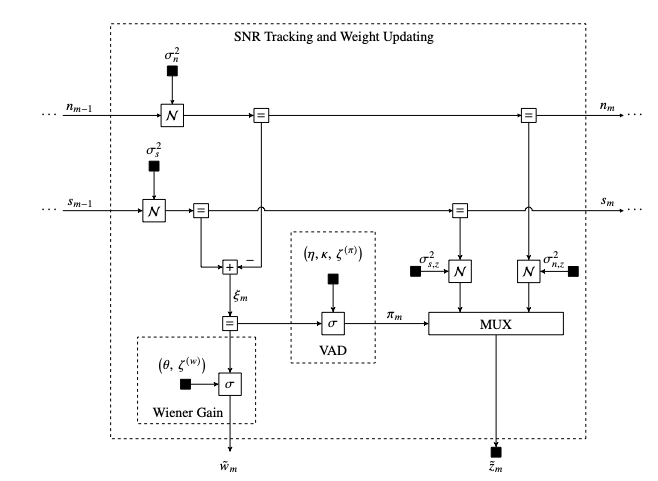
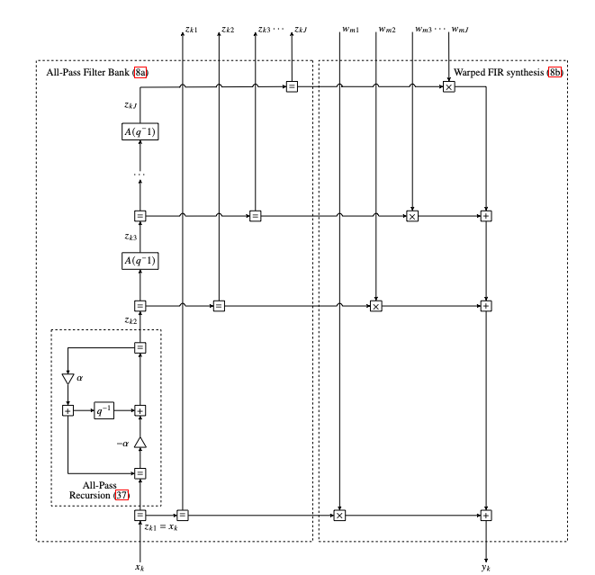

# A Probabilistic Generative Model for Spectral Speech Enhancement

This repository accompanies the paper:

> M. Hidalgo-Araya *et al.*, "A Probabilistic Generative Model for Spectral Speech Enhancement", 2025.

A comprehensive evaluation framework for virtual hearing aids using the VOICEBANK_DEMAND dataset with warped filter bank (WFB) preprocessing.

This revision of the repository reports **two complementary speech-quality metric families** side by side for transparency:

- The **DNSMOS P.835** non-intrusive metrics, reported as `DSIG`, `DBAK`, `DOVRL` (D-prefix so they stay visually parallel to the composite metrics and never get confused with them), used in the initial submission, and
- The **Hu & Loizou (2008) composite metrics** (CSIG, CBAK, COVL), which are the P.835-aligned intrusive metrics requested during the review cycle.

Both families are produced from the same evaluation run when `run_evaluation.jl` is invoked with `--composite`; earlier DNSMOS-only runs remain byte-identical when the flag is omitted.

## How This Repository Relates to the Paper

This repository provides the complete implementation and evaluation framework for the spectral speech enhancement model presented in the paper. It includes:

- **Implementation**: Full codebase for the Warped-Frequency Filter Bank (WFB) front-end and Speech Enhancement Model (SEM) backend
- **Evaluation Pipeline**: Automated evaluation on the VOICEBANK_DEMAND dataset with comprehensive metrics (PESQ, DNSMOS, and optionally the Hu & Loizou CSIG/CBAK/COVL composite metrics)
- **Reproducibility**: All configurations and scripts needed to reproduce the results reported in the paper, including the uniform-filter-bank (uFB) ablation
- **Benchmark Comparisons**: Automated generation of comparison tables 

## Overview

This repository provides a complete pipeline for:
1. **Dataset Preparation**: Download, resample, and preprocess VOICEBANK_DEMAND dataset
2. **WFB Preprocessing**: Create warped filter bank processed dataset for consistent evaluation
3. **Evaluation**: Run evaluations for baseline and hearing aid algorithms using `run_evaluation.jl`
4. **Results Analysis**: Generate summary tables and metrics organized by SNR and environment
5. **Benchmark Results**: Automatically generate and update benchmark comparison tables in the README

### Quick Start - View Benchmark Results

The latest benchmark results comparing different hearing aid algorithms are automatically generated and displayed in the [Benchmark Results](#benchmark-results) section below. To update these results with the latest evaluation runs, simply run:

```bash
julia scripts/update_readme_benchmark.jl
```

This script automatically:
- Finds the latest runs for each hearing aid (excluding Baseline_clean)
- Generates comprehensive comparison tables for:
  - Overall summary across all metrics
  - Performance by SNR level (2.5, 7.5, 12.5, 17.5 dB)
  - Performance by environment and SNR (bus, cafe, living, office, psquare)
- Updates the README with the latest results and configuration details

## Prerequisites

- **Julia 1.11+**: Required for all functionality
- **Python 3.7+**: Required for metrics evaluation (PESQ, DNSMOS)
- **Git**: For cloning and submodule management

### Installation

1. **Clone the repository with submodules:**
```bash
git clone --recursive https://github.com/biaslab/Publication_Spectral_Subtraction.git
cd Publication_Spectral_Subtraction
```

The `--recursive` flag is required because the repository pulls [microsoft/DNS-Challenge](https://github.com/microsoft/DNS-Challenge) as the `python_modules/DNSMOS/` submodule. DNSMOS ships as a standalone upstream project; vendoring it as a submodule pins the exact revision used for the paper's results and puts the ONNX models at the path the Julia wrapper expects (`python_modules/DNSMOS/DNSMOS/DNSMOS/{sig_bak_ovr,model_v8}.onnx`), so no manual path plumbing is needed.

If you already cloned without `--recursive`, initialize the submodule after the fact:

```bash
git submodule update --init --recursive --depth=1
```

`--depth=1` keeps the DNS-Challenge checkout shallow (~3 MB of ONNX weights plus the reference Python; the full upstream repo is ~275 MB and most of it is unused training data). If you plan to work with the upstream DNS-Challenge data, drop `--depth=1`.

2. **Install Julia dependencies:**
```julia
using Pkg
Pkg.activate(".")
Pkg.instantiate()
```

3. **Install Python dependencies for metrics:**
```bash
python install_python_deps.py
```

This installs `pesq`, the bundled `dnsmos_wrapper`, and `pysepm` (used by the optional Hu & Loizou CSIG/CBAK/COVL composite metrics). `pysepm` is installed directly from its GitHub archive because it is not on PyPI; if the install fails for any reason, the composite metrics are disabled at runtime and PESQ+DNSMOS continue to work as before.

## Complete Workflow

### Step 1: Download and Resample VOICEBANK_DEMAND Dataset

#### 1.1 Download the Dataset

Download the VOICEBANK_DEMAND dataset from the official source:

1. **Visit the official dataset page**: https://datashare.ed.ac.uk/handle/10283/2791
2. **Download the dataset files**
3. **Extract and place them in the following structure:**

```
databases/VOICEBANK_DEMAND/
├── data/
│   ├── clean_testset_wav/     # Clean audio files
│   └── noisy_testset_wav/     # Noisy audio files
├── logfiles/
│   └── log_testset.txt        # SNR information
└── testset_txt/               # Text transcriptions
```

#### 1.2 Resample the Dataset

Resample the VOICEBANK_DEMAND dataset to 16 kHz using Julia:

```julia
using HADatasets

# Create dataset instance pointing to the database directory
dataset = HADatasets.VOICEBANKDEMANDDataset("databases/VOICEBANK_DEMAND")

# Resample with default settings (16kHz, 1.0s minimum duration)
HADatasets.resample_data(dataset)
```

This creates:
```
databases/VOICEBANK_DEMAND_resampled/
├── clean_testset_wav/         # Resampled clean files
├── noisy_testset_wav/         # Resampled noisy files
└── logfiles/
    └── log_testset_resampled.txt  # Updated log file
```

**Note**: The resampled dataset preserves the same directory structure as the original, with all audio files resampled to 16 kHz.

### Step 2: Create WFB-Processed Dataset

**Why WFB preprocessing is needed:**

The hearing aid processing pipeline uses a **Warped Filter Bank (WFB)** that warps the frequency domain of the audio. Since **PESQ is sensitive to changes in the data or missing samples**, we need to ensure consistent preprocessing for fair evaluation. 

The WFB preprocessing:
- Processes all audio through the BaselineHearingAid (which has unity gains, so the audio is unaltered except for the WFB warping)
- Creates a preprocessed dataset where all files have been through the same WFB pipeline
- Ensures that when we evaluate hearing aids, we compare against a consistent WFB-processed clean reference

**Create the WFB dataset:**

```bash
julia scripts/convert_to_wfb.jl
```

Or test with a limited number of samples first:

```bash
julia scripts/convert_to_wfb.jl --num-samples=10
```

This script:
1. Loads the BaselineHearingAid configuration
2. Processes all clean and noisy files from `VOICEBANK_DEMAND_resampled` through the WFB
3. Creates `VOICEBANK_DEMAND_resampled_wfb/` with the same directory structure:
   ```
   databases/VOICEBANK_DEMAND_resampled_wfb/
   ├── clean_testset_wav/      # WFB-processed clean files
   ├── noisy_testset_wav/      # WFB-processed noisy files
   ├── logfiles/               # Copied logfiles
   ```

**Note**: If the WFB dataset already exists, the script will detect it and skip processing with the following messages:
```
[Info: WFB dataset already exists and appears to be processed
[Info: Skipping conversion - dataset already processed
```

### Step 3: Run Evaluations

All evaluations, including baselines and hearing aid algorithms, are run using the `run_evaluation.jl` script:

#### 3.1 Run Baseline Evaluations

Before evaluating hearing aids, establish baseline scores for comparison:

**Baseline Best (Clean vs Clean)** - Upper bound performance:
```bash
julia scripts/run_evaluation.jl configurations/baseline_clean/baseline_clean.toml
```

**Baseline Unprocessed (Clean vs Noisy)** - Lower bound performance:
```bash
julia scripts/run_evaluation.jl configurations/baseline_noise/baseline_noise.toml
```

#### 3.2 Run Hearing Aid Evaluations

Evaluate each hearing aid algorithm on the WFB-processed dataset:

```bash
# Evaluate SEM Hearing Aid with the warped filter bank front-end (apcoefficient = 0.5)
julia scripts/run_evaluation.jl configurations/SEMHearingAid/SEMHearingAid.toml

# Evaluate SEM Hearing Aid with the uniform filter bank front-end (apcoefficient = 0.0)
julia scripts/run_evaluation.jl configurations/SEMHearingAid_uFB/SEMHearingAid_uFB.toml
```

The two configurations above correspond to the WFB ablation reported in the OJ-SP revision (Section~VI "Structural Analysis of the WFB" and Appendix~E). They differ only in the filter-bank warping coefficient.

#### 3.3 Evaluation Options

```bash
# Test with a single file first
julia scripts/run_evaluation.jl configurations/SEMHearingAid/SEMHearingAid.toml --single-file p257_001.wav

# Limit number of samples for testing
julia scripts/run_evaluation.jl configurations/SEMHearingAid/SEMHearingAid.toml --num-samples 50

# Custom checkpoint interval (save every N files)
julia scripts/run_evaluation.jl configurations/SEMHearingAid/SEMHearingAid.toml --checkpoint-interval 20

# Save processed output audio files
julia scripts/run_evaluation.jl configurations/SEMHearingAid/SEMHearingAid.toml --save-output

# Also compute the Hu & Loizou (2008) CSIG/CBAK/COVL composite metrics
# (requires pysepm; installed by install_python_deps.py)
julia scripts/run_evaluation.jl configurations/SEMHearingAid/SEMHearingAid.toml --composite
```

`--composite` adds three columns (CSIG, CBAK, COVL) to `results.csv`, `overall_summary.csv`, `summary_by_snr.csv`, and `summary_by_environment_snr.csv`. When the flag is omitted, the output files are byte-identical to the pre-composite pipeline, so runs without `--composite` remain directly comparable to earlier releases (tag `v1.1.1`).

### Step 4: Results and Metrics

#### 4.1 Results Structure

Results are organized in timestamped directories:

```
results/VOICEBANK_DEMAND/
├── BaselineHearingAid/
│   └── run_<timestamp>/
│       ├── BaselineHearingAid.toml
│       └── table/
│           ├── results.csv                    # Complete results for all files
│           ├── overall_summary.csv           # Overall average scores
│           ├── summary_by_snr.csv            # Average scores by SNR level
│           ├── summary_by_environment_snr.csv # Average scores by environment and SNR
│           └── checkpoint_*.csv              # Optional checkpoint files (if --checkpoint-interval used)
│   └── run_<timestamp>/
│       └── ...
└── SEMHearingAid/
    └── run_<timestamp>/
        └── ...
```

#### 4.2 Metrics Computed

Each evaluation computes the following metrics:

- **PESQ** (Perceptual Evaluation of Speech Quality): 1-5 scale, higher is better
- **DSIG** (Signal Quality from DNSMOS): 1-5 scale, higher is better
- **DBAK** (Background Quality from DNSMOS): 1-5 scale, higher is better
- **DOVRL** (Overall Quality from DNSMOS): 1-5 scale, higher is better

When invoked with `--composite`, the evaluation additionally computes three Hu & Loizou (2008) composite metrics:

- **CSIG** (Composite Signal): 1-5 scale, higher is better; predicts MOS for speech distortion.
- **CBAK** (Composite Background): 1-5 scale, higher is better; predicts MOS for background intrusiveness.
- **COVL** (Composite Overall): 1-5 scale, higher is better; predicts the overall MOS.

CSIG/CBAK/COVL are linear regressions of PESQ, LLR, WSS, and segSNR tuned against ITU-T P.835 subjective ratings. They are reference-based (require the clean signal) and use the `pysepm` implementation of the Loizou reference code. If `pysepm` is not available at runtime, `--composite` raises a clear error and the non-composite pipeline is unaffected.

#### 4.3 Summary Tables

The evaluation automatically generates:

1. **`overall_summary.csv`**: Overall average scores across all conditions
2. **`summary_by_snr.csv`**: Average scores for each SNR level (2.5, 7.5, 12.5, 17.5 dB)
3. **`summary_by_environment_snr.csv`**: Average scores per environment per SNR level
4. **`results.csv`**: Complete results for all individual files

#### 4.4 Checkpointing

- **Automatic checkpoints**: Saved every N files (default: 10, configurable) - checkpoint files are created when using `--checkpoint-interval` option
- **Resume capability**: If evaluation is interrupted, checkpoints can be merged manually
- **Final results**: All results are saved to `results.csv` in the table directory

#### 4.5 Update Benchmark Results

After running evaluations for multiple hearing aids, you can automatically generate and update benchmark comparison tables in the README:

```bash
julia scripts/update_readme_benchmark.jl
```

This script:
- Finds the latest runs for each hearing aid (excluding Baseline_clean)
- Generates comprehensive comparison tables showing:
  - Overall summary across all metrics (PESQ, DSIG, DBAK, DOVRL, and optionally CSIG, CBAK, COVL)
  - Performance breakdown by SNR level (2.5, 7.5, 12.5, 17.5 dB)
  - Performance breakdown by environment and SNR (bus, cafe, living, office, psquare)
- Updates the README with the latest results and configuration details

The benchmark results are displayed in the [Benchmark Results](#benchmark-results) section below.

## Evaluation Metrics

This repository uses comprehensive speech quality assessment metrics to evaluate hearing aid algorithms. All metrics are computed using the HADatasets module, which provides standardized implementations of ITU-T and IEEE/ACM standards.

### PESQ (Perceptual Evaluation of Speech Quality)

- **Type**: Intrusive (requires reference signal)
- **Scale**: 1-5 (higher is better)
- **Standard**: ITU-T P.862.2
- **Use Case**: Overall speech quality assessment
- **Description**: PESQ is a perceptual metric that predicts the subjective quality of speech as perceived by human listeners. It compares the processed/enhanced audio to the clean reference signal and provides a score that correlates with Mean Opinion Score (MOS) ratings.

**Important Note**: PESQ is sensitive to changes in the data or missing samples. This is why the evaluation pipeline uses WFB-processed clean audio as the reference, ensuring that both the processed output and reference have undergone the same WFB preprocessing for fair comparison.

### DNSMOS (Deep Noise Suppression Mean Opinion Score)

- **Type**: Non-intrusive (no reference required)
- **Scale**: 1-5 (higher is better)
- **Standard**: Microsoft DNS Challenge P.835
- **Use Case**: Noise suppression quality assessment
- **Description**: DNSMOS is a deep learning-based metric that predicts subjective quality scores without requiring a clean reference signal. It follows the ITU-T P.835 subjective test framework to measure three key quality dimensions.

**P.835 Dimensions**:

- **DOVRL (DNSMOS Overall Quality)**: Overall audio quality assessment
  - Measures the overall perceived quality of the processed audio
  - Combines both speech and background noise quality perceptions

- **DSIG (DNSMOS Signal Quality)**: Speech quality assessment
  - Focuses specifically on the quality of the speech signal
  - Measures how natural and clear the speech sounds

- **DBAK (DNSMOS Background Quality)**: Background noise quality assessment
  - Evaluates the quality of the background/noise component
  - Measures how well noise is suppressed while preserving speech

The D-prefix is deliberate: it keeps these DNSMOS columns visually parallel to the `CSIG`/`CBAK`/`COVL` composite metrics so no one reading a table confuses the two families.

### Hu & Loizou (2008) Composite Metrics (CSIG, CBAK, COVL)

- **Type**: Intrusive (requires reference signal)
- **Scale**: 1-5 (higher is better)
- **Reference**: Hu, Y. and Loizou, P. C. (2008). "Evaluation of Objective Quality Measures for Speech Enhancement." IEEE Trans. Audio Speech Lang. Process. 16(1), 229–238.
- **Use Case**: Predict subjective P.835 MOS ratings directly from the time-domain clean/enhanced pair without the DNSMOS neural net.
- **Description**: CSIG, CBAK, and COVL are linear regressions of PESQ, LLR (log-likelihood ratio), WSS (weighted spectral slope), and segmental SNR against subjective ratings collected under the ITU-T P.835 protocol. We use the `pysepm` implementation of Loizou's reference MATLAB code.
- **Availability**: Computed only when `run_evaluation.jl` is invoked with `--composite`; requires `pysepm` (installed automatically by `install_python_deps.py`).

### Metric Selection Rationale

The combination of PESQ, DNSMOS, and (optionally) the Hu & Loizou composite metrics provides a comprehensive evaluation:

- **PESQ** provides an intrusive reference-based assessment, giving a direct comparison to the clean signal.
- **DNSMOS** provides a non-intrusive assessment that doesn't require a reference, making it useful for real-world scenarios where clean references may not be available. Its three P.835 dimensions (`DOVRL`, `DSIG`, `DBAK`) summarize overall, speech, and background quality from a deep acoustic model.
- **CSIG/CBAK/COVL** provide a second, classical P.835-aligned readout derived from well-established time/frequency features, and are reported alongside DNSMOS for transparency and cross-check.

### Research Context

This evaluation framework adopts the **ITU-T P.835 subjective test framework** to measure speech enhancement quality across multiple dimensions, enabling comprehensive assessment of hearing aid algorithms for monaural speech enhancement tasks.

## Directory Structure

```
Spectral_Subtraction/
├── databases/
│   ├── VOICEBANK_DEMAND/              # Original dataset (downloaded)
│   ├── VOICEBANK_DEMAND_resampled/    # Resampled dataset (16 kHz)
│   └── VOICEBANK_DEMAND_resampled_wfb/ # WFB-processed dataset
├── configurations/
│   ├── baseline_clean/
│   ├── baseline_noise/
│   ├── BaselineHearingAid/
│   ├── SEMHearingAid/                  # Paper algorithm (warped FB, apcoefficient=0.5)
│   └── SEMHearingAid_uFB/               # WFB ablation (uniform FB, apcoefficient=0.0)
├── results/
│   └── VOICEBANK_DEMAND/              # Evaluation results
├── scripts/
│   ├── convert_to_wfb.jl              # WFB conversion script
│   ├── run_evaluation.jl              # Per-config evaluation script
│   ├── run_paper_results.jl           # One-command reproduction orchestrator
│   └── update_readme_benchmark.jl     # Benchmark results update script
├── src/
│   ├── Experiments.jl                 # Main evaluation module
│   ├── HADatasets/                    # Dataset loaders and metrics (PESQ, DNSMOS, CSIG/CBAK/COVL)
│   ├── HASoundProcessing/             # SEM factor graph + inference rules
│   └── VirtualHearingAid/             # WFB front-end and hearing-aid backends
└── python_modules/                    # PyCall-side wrappers (dnsmos_wrapper, composite_wrapper)
```

## Key Concepts

### Speech Enhancement Module (SEM)

The SEM follows the model introduced in the paper:



The Speech Enhancement Model (SEM) uses a probabilistic generative model for Bayesian inference of speech and noise characteristics, enabling adaptive spectral enhancement.

### Warped-Frequency Filter Bank (WFB)

The WFB front-end provides perceptually-aligned frequency warping for consistent evaluation:



The input signal passes through a cascade of first-order all-pass filters, producing warped delay-line signals. A time-domain FIR structure with weights generates the output, while the warped signals are provided to the Spectral Enhancement Model for inference and synthesis.


### Evaluation Pipeline

1. **Input**: WFB-processed noisy audio (`VOICEBANK_DEMAND_resampled_wfb/noisy_testset_wav/`)
2. **Processing**: Pass through hearing aid algorithm
3. **Reference**: WFB-processed clean audio (`VOICEBANK_DEMAND_resampled_wfb/clean_testset_wav/`)
4. **Metrics**: Compare processed output to WFB-processed clean reference

## Supported Hearing Aid Types

- **BaselineHearingAid**: Unity gain processing (no noise reduction, WFB only)
- **SEMHearingAid**: Speech Enhancement Model (Bayesian inference)

## Reproducing the Paper Results

### One-command reproduction (recommended)

If you just want to regenerate every table in the paper, including the WFB ablation and the composite metrics added in the revision, run:

```bash
julia --project=. scripts/run_paper_results.jl
```

This single orchestrator:

1. Resamples VoiceBank+DEMAND to 16 kHz (skipped if already done).
2. Generates the WFB-processed reference dataset (skipped if already done).
3. Evaluates the four configurations used by the paper tables with
   `--composite --checkpoint-interval 50`, so every per-file row and every
   summary CSV carries the seven metrics (PESQ, DSIG, DBAK, DOVRL, CSIG, CBAK,
   COVL):
   - `configurations/baseline_clean/baseline_clean.toml` (upper bound)
   - `configurations/baseline_noise/baseline_noise.toml` (unprocessed lower bound)
   - `configurations/SEMHearingAid/SEMHearingAid.toml` (paper algorithm, warped FB)
   - `configurations/SEMHearingAid_uFB/SEMHearingAid_uFB.toml` (WFB ablation, uniform FB)
4. Calls `scripts/update_readme_benchmark.jl` to refresh the markdown tables
   at the bottom of this README.

The orchestrator is idempotent: re-running it after a clean pass only
regenerates the README tables; re-running after an interrupted evaluation
resumes from the last checkpoint.

Before running it once, you still need to:

- Clone the repository with `git clone --recursive …` (so the
  `python_modules/DNSMOS/` submodule is initialized; see Installation above).
- Instantiate the Julia project: `julia --project=. -e 'using Pkg; Pkg.instantiate()'`.
- Install the Python dependencies: `python install_python_deps.py`.
- Download the raw VoiceBank+DEMAND corpus into `databases/VOICEBANK_DEMAND/`
  as described in [Step 1](#step-1-download-and-resample-voicebank_demand-dataset).

### Manual step-by-step reproduction

If you prefer to run each stage yourself (for debugging, or to run only a subset):

1. Prepare the `VOICEBANK_DEMAND_resampled_wfb` dataset by following Steps 1 and 2 in this README.

2. Run the hearing-aid configurations, passing `--composite` so that each run reports both the DNSMOS metrics (`DSIG`, `DBAK`, `DOVRL`) and the Hu & Loizou composite metrics (`CSIG`, `CBAK`, `COVL`):

   ```bash
   # Main paper algorithm (warped filter bank, apcoefficient = 0.5)
   julia scripts/run_evaluation.jl configurations/SEMHearingAid/SEMHearingAid.toml --composite --checkpoint-interval 50

   # WFB ablation (uniform filter bank, apcoefficient = 0.0)
   julia scripts/run_evaluation.jl configurations/SEMHearingAid_uFB/SEMHearingAid_uFB.toml --composite --checkpoint-interval 50
   ```

3. Update the README tables:

   ```bash
   julia scripts/update_readme_benchmark.jl
   ```

4. The results used in the paper correspond to the runs in:
   ```
   results/VOICEBANK_DEMAND/<Device>/run_<timestamp>/
   ```

   Each run directory contains a single `results.csv` with all seven metrics
   (PESQ, DSIG, DBAK, DOVRL, CSIG, CBAK, COVL) plus three summary CSVs broken
   down by SNR and by (environment, SNR), ready to paste into the paper.

## Extending the Framework

To add a new hearing aid algorithm:

1. **Implement the backend** in `src/VirtualHearingAid/` (create a new `<Name>Backend` type).

2. **Create a configuration file** in `configurations/<NewHearingAid>/<NewHearingAid>.toml`:
   - `[parameters.hearingaid]` with `type = "<NewHearingAid>"`
   - `[parameters.frontend]` WFB parameters (nbands, fs, etc.)
   - `[parameters.backend.*]` for algorithm-specific parameters

3. **Run evaluation**:
   ```bash
   julia scripts/run_evaluation.jl configurations/<NewHearingAid>/<NewHearingAid>.toml
   ```

4. **Update the benchmark tables**:
   ```bash
   julia scripts/update_readme_benchmark.jl
   ```

See existing configurations in `configurations/` for examples of the TOML structure.

## Runtime and Hardware Requirements

- **Tested on**: macOS / Linux, Julia 1.11+, Python 3.7+
- **GPU**: Not required. All models are CPU-friendly
- **Storage**: ~2 GB for the resampled dataset, ~4 GB for the WFB-processed dataset

## Troubleshooting

### Dataset Issues

- **Missing files**: Ensure the dataset is downloaded and extracted correctly
- **Resampling errors**: Check that audio files are valid WAV files
- **WFB conversion fails**: Verify BaselineHearingAid configuration exists

### Evaluation Issues

- **Memory errors**: Use `--num-samples` to process in smaller batches
- **Checkpoint errors**: Manually merge existing checkpoints if needed
- **Metrics errors**: Ensure Python dependencies are installed (`python install_python_deps.py`)
- **`ImportError: No module named 'dnsmos_local'`**: The `python_modules/DNSMOS/` submodule was not initialized. Run `git submodule update --init --recursive --depth=1` from the repository root.
- **CSIG/CBAK/COVL missing from results**: `--composite` was not passed to `run_evaluation.jl`, or `pysepm` failed to install. Re-run `python install_python_deps.py` and confirm `pysepm` imports in Python.

## Optional Dependencies

The metrics evaluation functionality relies on Python integration and the following optional dependencies:

- **PyCall**: Python integration (for full metrics functionality)
- **pesq**: Python PESQ implementation (MIT License)
- **dnsmos_wrapper**: Custom wrapper for Microsoft DNSMOS (Creative Commons Attribution 4.0 International)
- **pysepm**: Python port of Loizou's composite-metrics MATLAB code, used for CSIG/CBAK/COVL (MIT-style licence; installed from the upstream GitHub archive)

These dependencies are automatically installed when running the Python installation script:
```bash
python install_python_deps.py
```

If `pysepm` cannot be installed for some reason, PESQ and DNSMOS continue to work; only the optional `--composite` path is disabled.

## Third-Party Licenses

### Microsoft DNS-Challenge (DNSMOS submodule)

Licensed under **Creative Commons Attribution 4.0 International**:

- **Attribution Required**: Must give appropriate credit to Microsoft
- **Commercial Use**: Allowed
- **Modification**: Allowed
- **Distribution**: Allowed

## Citations

### DNSMOS P.835

```bibtex
@inproceedings{reddy2022dnsmos,
  title={DNSMOS P.835: A non-intrusive perceptual objective speech quality metric to evaluate noise suppressors},
  author={Reddy, Chandan KA and Gopal, Vishak and Cutler, Ross},
  booktitle={ICASSP 2022 IEEE International Conference on Acoustics, Speech and Signal Processing (ICASSP)},
  year={2022},
  organization={IEEE}
}
```

### ICASSP 2023 Deep Noise Suppression Challenge

```bibtex
@inproceedings{dubey2023icassp,
  title={ICASSP 2023 Deep Noise Suppression Challenge},
  author={Dubey, Harishchandra and Aazami, Ashkan and Gopal, Vishak and Naderi, Babak and Braun, Sebastian and Cutler, Ross and Gamper, Hannes and Golestaneh, Mehrsa and Aichner, Robert},
  booktitle={ICASSP},
  year={2023}
}
```

### VOICEBANK DEMAND Dataset

```bibtex
@misc{Valentini-Botinhao2017NoisySpeech,
  author = {Valentini-Botinhao, Cassia},
  title = {Noisy speech database for training speech enhancement algorithms and TTS models},
  year = {2017},
  howpublished = {Edinburgh DataShare},
  doi = {10.7488/ds/2117},
  url = {https://doi.org/10.7488/ds/2117}
}
```

### Hu & Loizou Composite Metrics (CSIG/CBAK/COVL)

```bibtex
@article{hu2008evaluation,
  title={Evaluation of Objective Quality Measures for Speech Enhancement},
  author={Hu, Yi and Loizou, Philipos C.},
  journal={IEEE Transactions on Audio, Speech, and Language Processing},
  volume={16},
  number={1},
  pages={229--238},
  year={2008},
  publisher={IEEE}
}
```

## Related Resources

- **[ICASSP 2023 Deep Noise Suppression Challenge](https://www.microsoft.com/en-us/research/academic-program/deep-noise-suppression-challenge-icassp-2023/)**: Official challenge website and resources
- **[DNSMOS Implementation](https://github.com/microsoft/DNS-Challenge)**: Microsoft's DNS Challenge repository with DNSMOS implementation
- **[VoiceBank+Demand Dataset](https://datashare.ed.ac.uk/handle/10283/2791)**: Official dataset download page
