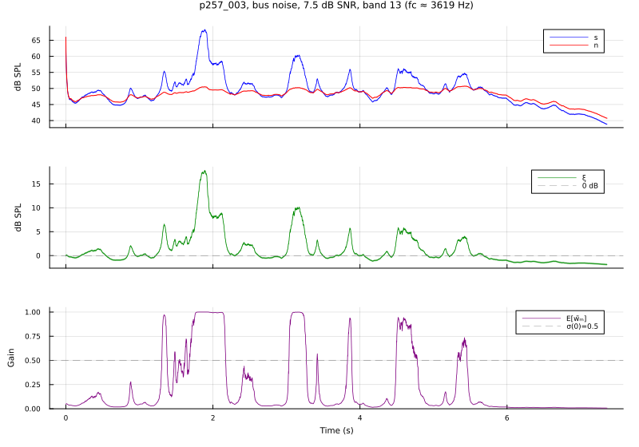

# Paper Results — VoiceBank+DEMAND

Auto-generated by `scripts/generate_results_md.jl` from the latest evaluation runs under `results/VOICEBANK_DEMAND/`. Regenerate with:

```bash
julia --project=. scripts/generate_results_md.jl
```

This is the reviewer-facing companion to the paper's Results section. Every value below comes from the same runs that populate the LaTeX tables under `tables/` (the `generate_latex_tables.jl` script emits both).


## Parameter-evolution figure

Posterior trajectories during SEM inference for a representative utterance (`p257_003`, bus noise, 7.5 dB input SNR), frequency band 13 (centre frequency ≈ 3.6 kHz). From top to bottom: (a) latent log speech power *s* and log noise power *n* in dB SPL, each with a ±1σ ribbon; (b) log-SNR *ξ* with a ±1σ ribbon; (c) spectral filter coefficient 𝔼[*w̃ₘ*].

Regenerate with:

```bash
julia --project=. scripts/plot_parameter_evolution.jl
```




## Tables

### Table 3 — Overall comparison

Sample mean ± one sample standard deviation over the 824-file test set.

| System | PESQ | CSIG | CBAK | COVL |
|---|---|---|---|---|
| Unprocessed | 1.96 ± 0.76 | 3.33 ± 0.87 | 2.44 ± 0.67 | 2.62 ± 0.83 |
| SEM (uFB) | 2.05 ± 0.72 | 3.34 ± 0.85 | 2.17 ± 0.48 | 2.66 ± 0.81 |
| SEM (WFB) | 2.17 ± 0.76 | 3.44 ± 0.88 | 2.61 ± 0.63 | 2.78 ± 0.84 |


### Table 4 — WFB ablation

SEM with the warped filter bank (α = 0.5) vs. the ablated uniform filter bank (α = 0), all other parameters unchanged. Sample mean ± one sample standard deviation over the 824-file test set. **Δ** is the per-metric difference WFB − uFB.

| System | PESQ | CSIG | CBAK | COVL |
|---|---|---|---|---|
| SEM (uFB, α = 0)   | 2.05 ± 0.72 | 3.34 ± 0.85 | 2.17 ± 0.48 | 2.66 ± 0.81 |
| SEM (WFB, α = 0.5) | 2.17 ± 0.76 | 3.44 ± 0.88 | 2.61 ± 0.63 | 2.78 ± 0.84 |
| **Δ (WFB − uFB)**  | +0.12 | +0.10 | +0.44 | +0.12 |


### Table 5 — Per-environment × per-SNR ablation (mean ± std)

For each of PESQ / CSIG / CBAK / COVL, the mean ± one sample standard deviation over the files assigned to each (environment, SNR) cell, for the three systems.

#### PESQ

| Env | System | 2.5 dB | 7.5 dB | 12.5 dB | 17.5 dB |
|---|---|---|---|---|---|
| BUS | Unprocessed | 1.75 ± 0.51 | 2.25 ± 0.63 | 2.69 ± 0.57 | 3.19 ± 0.67 |
|  | SEM (uFB) | 1.87 ± 0.51 | 2.37 ± 0.59 | 2.73 ± 0.52 | 3.20 ± 0.50 |
|  | SEM (WFB) | 2.01 ± 0.57 | 2.58 ± 0.56 | 2.88 ± 0.55 | 3.33 ± 0.52 |
| CAFE | Unprocessed | 1.15 ± 0.10 | 1.33 ± 0.22 | 1.54 ± 0.31 | 1.92 ± 0.49 |
|  | SEM (uFB) | 1.18 ± 0.13 | 1.40 ± 0.25 | 1.68 ± 0.34 | 2.08 ± 0.44 |
|  | SEM (WFB) | 1.20 ± 0.14 | 1.44 ± 0.29 | 1.74 ± 0.36 | 2.24 ± 0.38 |
| LIVING | Unprocessed | 1.17 ± 0.10 | 1.39 ± 0.25 | 1.68 ± 0.35 | 2.21 ± 0.42 |
|  | SEM (uFB) | 1.24 ± 0.15 | 1.50 ± 0.30 | 1.81 ± 0.41 | 2.27 ± 0.38 |
|  | SEM (WFB) | 1.27 ± 0.18 | 1.58 ± 0.33 | 1.94 ± 0.36 | 2.37 ± 0.34 |
| PSQUARE | Unprocessed | 1.24 ± 0.16 | 1.44 ± 0.27 | 1.80 ± 0.50 | 2.35 ± 0.46 |
|  | SEM (uFB) | 1.33 ± 0.20 | 1.57 ± 0.30 | 1.90 ± 0.48 | 2.46 ± 0.46 |
|  | SEM (WFB) | 1.39 ± 0.26 | 1.66 ± 0.31 | 1.98 ± 0.49 | 2.63 ± 0.43 |
| OFFICE | Unprocessed | 1.75 ± 0.43 | 2.29 ± 0.54 | 2.76 ± 0.46 | 3.23 ± 0.46 |
|  | SEM (uFB) | 1.94 ± 0.42 | 2.47 ± 0.48 | 2.77 ± 0.39 | 3.22 ± 0.41 |
|  | SEM (WFB) | 2.14 ± 0.38 | 2.67 ± 0.36 | 2.93 ± 0.40 | 3.40 ± 0.39 |

#### CSIG

| Env | System | 2.5 dB | 7.5 dB | 12.5 dB | 17.5 dB |
|---|---|---|---|---|---|
| BUS | Unprocessed | 3.22 ± 0.50 | 3.78 ± 0.54 | 4.23 ± 0.50 | 4.59 ± 0.49 |
|  | SEM (uFB) | 3.23 ± 0.50 | 3.78 ± 0.51 | 4.20 ± 0.46 | 4.58 ± 0.44 |
|  | SEM (WFB) | 3.37 ± 0.52 | 3.96 ± 0.51 | 4.32 ± 0.47 | 4.66 ± 0.43 |
| CAFE | Unprocessed | 1.94 ± 0.43 | 2.51 ± 0.43 | 2.94 ± 0.39 | 3.43 ± 0.45 |
|  | SEM (uFB) | 1.94 ± 0.43 | 2.52 ± 0.43 | 2.98 ± 0.39 | 3.47 ± 0.39 |
|  | SEM (WFB) | 1.97 ± 0.45 | 2.58 ± 0.46 | 3.05 ± 0.42 | 3.61 ± 0.39 |
| LIVING | Unprocessed | 2.10 ± 0.35 | 2.55 ± 0.42 | 3.03 ± 0.36 | 3.48 ± 0.54 |
|  | SEM (uFB) | 2.11 ± 0.36 | 2.55 ± 0.48 | 3.05 ± 0.39 | 3.45 ± 0.52 |
|  | SEM (WFB) | 2.14 ± 0.38 | 2.62 ± 0.50 | 3.16 ± 0.37 | 3.54 ± 0.52 |
| PSQUARE | Unprocessed | 2.63 ± 0.31 | 2.95 ± 0.26 | 3.46 ± 0.41 | 3.92 ± 0.41 |
|  | SEM (uFB) | 2.66 ± 0.32 | 2.98 ± 0.27 | 3.46 ± 0.40 | 3.92 ± 0.42 |
|  | SEM (WFB) | 2.72 ± 0.36 | 3.08 ± 0.28 | 3.55 ± 0.42 | 4.06 ± 0.45 |
| OFFICE | Unprocessed | 3.18 ± 0.32 | 3.81 ± 0.39 | 4.26 ± 0.35 | 4.69 ± 0.31 |
|  | SEM (uFB) | 3.26 ± 0.33 | 3.86 ± 0.36 | 4.21 ± 0.30 | 4.64 ± 0.32 |
|  | SEM (WFB) | 3.42 ± 0.32 | 4.02 ± 0.31 | 4.34 ± 0.33 | 4.76 ± 0.29 |

#### CBAK

| Env | System | 2.5 dB | 7.5 dB | 12.5 dB | 17.5 dB |
|---|---|---|---|---|---|
| BUS | Unprocessed | 1.97 ± 0.30 | 2.50 ± 0.38 | 2.98 ± 0.39 | 3.52 ± 0.47 |
|  | SEM (uFB) | 1.93 ± 0.27 | 2.32 ± 0.30 | 2.61 ± 0.29 | 2.93 ± 0.29 |
|  | SEM (WFB) | 2.25 ± 0.32 | 2.78 ± 0.34 | 3.16 ± 0.35 | 3.57 ± 0.37 |
| CAFE | Unprocessed | 1.56 ± 0.16 | 1.93 ± 0.26 | 2.28 ± 0.29 | 2.80 ± 0.39 |
|  | SEM (uFB) | 1.48 ± 0.14 | 1.76 ± 0.18 | 2.01 ± 0.19 | 2.30 ± 0.24 |
|  | SEM (WFB) | 1.67 ± 0.18 | 2.06 ± 0.26 | 2.44 ± 0.28 | 2.90 ± 0.26 |
| LIVING | Unprocessed | 1.56 ± 0.13 | 1.94 ± 0.23 | 2.31 ± 0.32 | 2.88 ± 0.31 |
|  | SEM (uFB) | 1.53 ± 0.13 | 1.83 ± 0.19 | 2.08 ± 0.22 | 2.40 ± 0.20 |
|  | SEM (WFB) | 1.73 ± 0.17 | 2.15 ± 0.25 | 2.54 ± 0.27 | 2.97 ± 0.24 |
| PSQUARE | Unprocessed | 1.69 ± 0.18 | 2.04 ± 0.22 | 2.48 ± 0.36 | 3.02 ± 0.32 |
|  | SEM (uFB) | 1.64 ± 0.18 | 1.89 ± 0.16 | 2.16 ± 0.23 | 2.52 ± 0.23 |
|  | SEM (WFB) | 1.90 ± 0.24 | 2.25 ± 0.20 | 2.64 ± 0.31 | 3.14 ± 0.33 |
| OFFICE | Unprocessed | 2.06 ± 0.27 | 2.57 ± 0.39 | 3.06 ± 0.34 | 3.59 ± 0.35 |
|  | SEM (uFB) | 2.03 ± 0.26 | 2.42 ± 0.24 | 2.66 ± 0.20 | 2.97 ± 0.21 |
|  | SEM (WFB) | 2.41 ± 0.24 | 2.88 ± 0.28 | 3.24 ± 0.28 | 3.66 ± 0.29 |

#### COVL

| Env | System | 2.5 dB | 7.5 dB | 12.5 dB | 17.5 dB |
|---|---|---|---|---|---|
| BUS | Unprocessed | 2.43 ± 0.49 | 3.00 ± 0.59 | 3.46 ± 0.54 | 3.95 ± 0.63 |
|  | SEM (uFB) | 2.50 ± 0.49 | 3.05 ± 0.55 | 3.46 ± 0.49 | 3.92 ± 0.50 |
|  | SEM (WFB) | 2.64 ± 0.54 | 3.25 ± 0.54 | 3.60 ± 0.51 | 4.04 ± 0.53 |
| CAFE | Unprocessed | 1.46 ± 0.26 | 1.86 ± 0.32 | 2.20 ± 0.35 | 2.66 ± 0.47 |
|  | SEM (uFB) | 1.47 ± 0.27 | 1.90 ± 0.34 | 2.29 ± 0.36 | 2.75 ± 0.41 |
|  | SEM (WFB) | 1.50 ± 0.28 | 1.95 ± 0.38 | 2.36 ± 0.39 | 2.90 ± 0.39 |
| LIVING | Unprocessed | 1.55 ± 0.19 | 1.92 ± 0.31 | 2.32 ± 0.35 | 2.83 ± 0.46 |
|  | SEM (uFB) | 1.59 ± 0.22 | 1.97 ± 0.37 | 2.40 ± 0.39 | 2.84 ± 0.43 |
|  | SEM (WFB) | 1.62 ± 0.24 | 2.05 ± 0.40 | 2.51 ± 0.36 | 2.94 ± 0.42 |
| PSQUARE | Unprocessed | 1.87 ± 0.23 | 2.15 ± 0.25 | 2.61 ± 0.46 | 3.13 ± 0.43 |
|  | SEM (uFB) | 1.93 ± 0.26 | 2.23 ± 0.27 | 2.66 ± 0.43 | 3.18 ± 0.44 |
|  | SEM (WFB) | 2.00 ± 0.31 | 2.33 ± 0.29 | 2.74 ± 0.45 | 3.34 ± 0.44 |
| OFFICE | Unprocessed | 2.44 ± 0.36 | 3.04 ± 0.47 | 3.52 ± 0.40 | 4.00 ± 0.41 |
|  | SEM (uFB) | 2.57 ± 0.36 | 3.16 ± 0.42 | 3.50 ± 0.34 | 3.96 ± 0.38 |
|  | SEM (WFB) | 2.75 ± 0.34 | 3.34 ± 0.34 | 3.65 ± 0.37 | 4.12 ± 0.37 |


### Table 6 — Per-environment improvement (averaged across SNRs)

**Δ_{U→W}** = SEM (WFB) − Unprocessed; **Δ_{u→W}** = SEM (WFB) − SEM (uFB) (WFB ablation). Each value is the mean over the four input SNRs.

| Env | Δ_{U→W} PESQ | Δ_{U→W} CSIG | Δ_{U→W} CBAK | Δ_{U→W} COVL | Δ_{u→W} PESQ | Δ_{u→W} CSIG | Δ_{u→W} CBAK | Δ_{u→W} COVL |
|---|---|---|---|---|---|---|---|---|
| BUS | +0.23 | +0.12 | +0.20 | +0.18 | +0.16 | +0.13 | +0.49 | +0.15 |
| CAFE | +0.17 | +0.10 | +0.12 | +0.13 | +0.07 | +0.08 | +0.38 | +0.07 |
| LIVING | +0.17 | +0.08 | +0.17 | +0.13 | +0.08 | +0.08 | +0.39 | +0.08 |
| PSQUARE | +0.21 | +0.11 | +0.17 | +0.16 | +0.10 | +0.10 | +0.43 | +0.10 |
| OFFICE | +0.28 | +0.15 | +0.23 | +0.22 | +0.18 | +0.14 | +0.53 | +0.17 |
